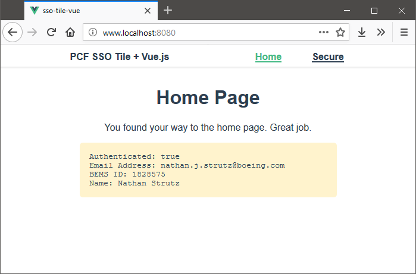

# SSO Tile with Vue.js


An application to show Vue.js connecting to PCF Single Sign-On Services (SSO Tile).

The application was created with the Vue CLI and uses Vue-Router for navigation, Vuex for auth state management, and OIDC-Client-JS to communicate with SSO Tile.

## SSO Tile

SSO Tile is **the only way** to confirm a user's identity on a static, JavaScript-based, single page application (SPA). This includes Vue, React, Angular, and other similar client-side-only application technologies. SSO Tile solves the problem of identity on the intranet, and is the only choice for SPAs.

## The Example App

```bash
$ npm install
# installing npm packages...
$ npm run serve
```

Open the browser at the location indicated, which should be http://localhost:8080/




## OIDC-Client-JS Vs. Cloud Foundry

A sore spot in the current state of OpenID Connect is the OIDC-Client-JS library. It's the only client-side javascript library [approved by OpenID](https://openid.net/developers/certified/), and the best choice on the market, however versions beginning with 1.6 block the ability to use the OIDC Hybrid Flow. See [Scott Brady's Blog Post about OpenID Connect Flows](https://www.scottbrady91.com/OpenID-Connect/OpenID-Connect-Flows) for more information.

With Hybrid out of the picture, Authorization Code flow should be available, however Cloud Foundry meets the coded request for authorization with a `401: Unauthorized` error and no other explanation. Moving on, you may read that Implicit Flow is the best (and only remaining) choice, and that's correct, except that Implicit Flow is specifically blocked by PCF, returning the error: `Unauthorized grant type: Implicit`. So here we are stuck between a rock and a hard place.

The solution then is to use an older version of OIDC-Client-JS. **Version 1.5.4** is the last version that supported our Hybrid Flow, and the only version that I recommend.

## SSO Tile Configuration


#### Add the SSO Tile Service

1. Log in to the PCF apps manager
2. Select the proper Org (app/team area) and Space (dev/test/etc)
3. Go to Services and click the Add A Service button
5. Give your instance a name and don't bind any apps

#### Configure the identity zone

Find the PCF Single Sign-On service management tool by navigating, in the Pivotal Apps Manager, to:

> [Service](#) > [Single Sign-On](#) > [Manage](#)

Add a new "app" or identity zone and make these changes:

1. Give this identity zone a name
2. Leave the application type at Web App
3. The App Launch URL area is unimportant
5. Redirect URIs are the valid base URLs that this Tile will allow to authenticate, this is a comma-separated list of all the URLs you may have the app running at and should be allowed to get a token
6. For Authorization Scopes, add the `profile` scope, which gives us person-identifying data in the token
    - The Select Scopes dialog may be confusing, but make sure Profile is selected _and_ checked when done
    - The Profile permission should show up on the main form after closing the dialog
    - Leave the `openid` scope on there, don't remove it
7. On the Auto-Approved Scopes, make sure to select everything; failing to do so will prompt the end user to select them manually every time they log in
8. Change anything else you want (like timeout values) and save to create the SSO Tile app

After this configuration setup, the management tool will provide you with the chance to download the application secret (download it!), and provide you with links and other configuration data. Take note of these data points you need in your configuration:

-   App ID - aka the Client ID to uniquely identify this app & configuration
-   SSO Service URL - aka the Client URL or Authority for the OIDC Client

## Still TODO:

-   Handle token invalidation (timeouts, should re-auth when necessary)
